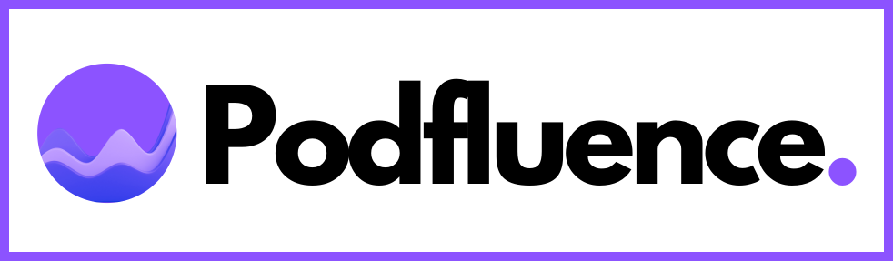

   

# Podfluence

Podfluence is an application to transcribe, summarize, and ask questions about the content of a podcast.

## Getting Started

### Deploying the API
The below steps assumes that you already have: (1) An OpenAI API Key, and (2) Set up a MySQL Database.

1. Run `sudo ./setup.sh`.
2. Create a conda environment `conda create --name <ENV_NAME> python=3.9` and activate it `conda activate <ENV_NAME>`.
3. Install the python libraries `pip install -r requirements.txt`.
3. Go to `/lib`.
4. Change the parameters in `api_config.json` according to your set up database, and your OpenAI API key.
5. Note the location of your conda environment's python path, it should be in `/home/<USERNAME>/anaconda3/envs/<ENV_NAME>/bin/python`. But if not, check it using `which conda`.
6. Run the api using `/home/<USERNAME>/anaconda3/envs/<ENV_NAME>/bin/python -m uvicorn api:app --host 0.0.0.0 --reload --port 21212`.
7. You can access the API from `localhost:21212` and the docs at `localhost:21212/docs`.
